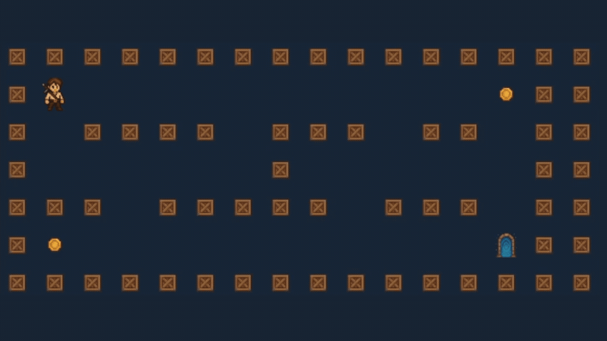

# so_long

A 2D game built with the MiniLibX library as part of the 42 School curriculum. The player must collect all collectibles and reach the exit while navigating through a maze-like map.

## Demo



## Features

- **2D Top-down View**: Navigate through maps using WASD or arrow keys
- **Collectible System**: Gather all items before accessing the exit
- **Move Counter**: Tracks player movements displayed in terminal
- **Map Validation**: Comprehensive validation ensures playable maps
- **Clean Graphics**: Custom XPM sprites for all game elements

## Game Elements

| Element | Symbol | Description |
|---------|--------|-------------|
| Player | `P` | Starting position (must have exactly 1) |
| Wall | `1` | Impassable barriers |
| Floor | `0` | Walkable empty space |
| Collectible | `C` | Items to collect (must have at least 1) |
| Exit | `E` | Goal destination (must have exactly 1) |

## Controls

- **WASD** or **Arrow Keys**: Move player
- **ESC**: Exit game
- **X (Window Close)**: Exit game

## Installation

### Prerequisites

- Linux operating system
- MiniLibX library
- GCC compiler
- Make

### Building

```bash
git clone [your-repository-url]
cd so_long
make
```

## Usage

```bash
./so_long maps/map.ber
```

### Map Requirements

Maps must be `.ber` files following these rules:

1. **Rectangular**: All rows must have the same length
2. **Walled**: Completely surrounded by walls (`1`)
3. **Minimum Size**: At least 3x3
4. **Single Player**: Exactly one player start position (`P`)
5. **Single Exit**: Exactly one exit (`E`)
6. **Collectibles**: At least one collectible (`C`)
7. **Valid Path**: All collectibles and the exit must be reachable from the player start

### Example Map

```
111111111
100000001
10C000C01
100P00001
1000E0001
111111111
```

## Map Validation

The program performs comprehensive validation:

- **File Format**: Checks `.ber` extension and file accessibility
- **Structure**: Validates rectangular shape and wall boundaries
- **Elements**: Ensures correct count of required elements
- **Pathfinding**: Uses DFS to verify all collectibles and exit are reachable
- **Error Handling**: Provides detailed error messages for invalid maps

## Project Structure

```
SO_LONG/
├── assets/                # Game assets directory
├── get_next_line/         # Line reading library
├── maps/                  # Map files directory
├── minilibx-linux/        # Graphics library
├── Makefile              # Build configuration
├── map_utils.c           # Map duplication and DFS utilities
├── map_utils2.c          # Map copying and pathfinding helpers
├── map_validator.c       # Core map validation functions
├── map_validator2.c      # Validation orchestration
├── map_validator3.c      # Element counting and validation
├── so_long.c             # Main program and file handling
├── so_long.h             # Header with structures and prototypes
├── so_long2.c            # Map reading and initialization
├── so_long3.c            # Dimension validation utilities
├── so_long4.c            # File operations and error handling
├── so_long5.c            # Map allocation and reading loops
├── so_long6.c            # Dimension scanning and line processing
├── utils.c               # General utilities and error handling
├── window_utils.c        # Graphics initialization
├── window_utils2.c       # Image loading and game setup
├── window_utils3.c       # Rendering and drawing functions
├── window_utils4.c       # Player movement and input handling
├── window_utils5.c       # Image validation and error handling
└── window_utils6.c       # Expose event handling
```

## Technical Details

### Map Loading
- Uses `get_next_line` for efficient file reading
- Dynamic memory allocation for variable map sizes
- Comprehensive error handling with proper cleanup

### Pathfinding Algorithm
- Depth-First Search (DFS) implementation
- Validates reachability of all collectibles and exit
- Creates map copies to avoid modifying original data

### Graphics
- MiniLibX integration for cross-platform compatibility
- 64x64 pixel tiles for clear visibility
- Efficient rendering with selective tile updates

### Memory Management
- Proper allocation and deallocation of all resources
- Error handling with cleanup to prevent memory leaks
- Safe exit procedures for all termination scenarios

## Development Notes

This project demonstrates:
- **C Programming**: Complex data structures and algorithms
- **Graphics Programming**: 2D rendering and event handling
- **File I/O**: Robust file reading and parsing
- **Error Handling**: Comprehensive validation and cleanup
- **Algorithm Implementation**: Pathfinding and map validation

## Author

**bmezher** - 42 School Student

## License

This project is part of the 42 School curriculum.